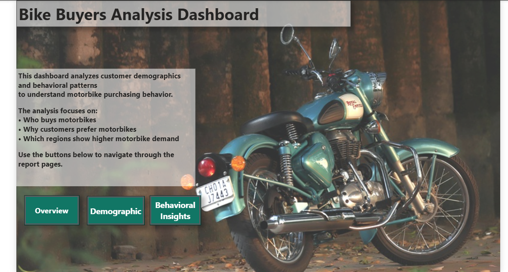
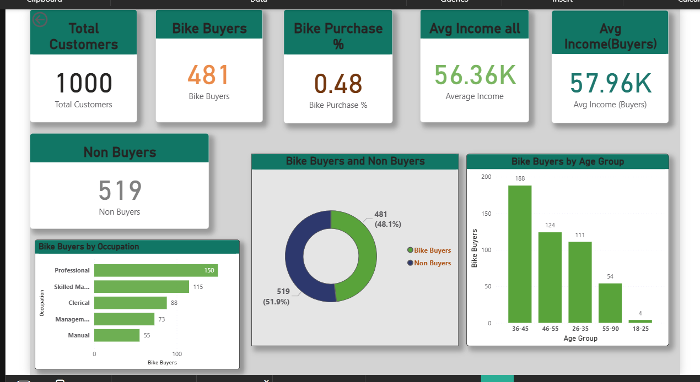
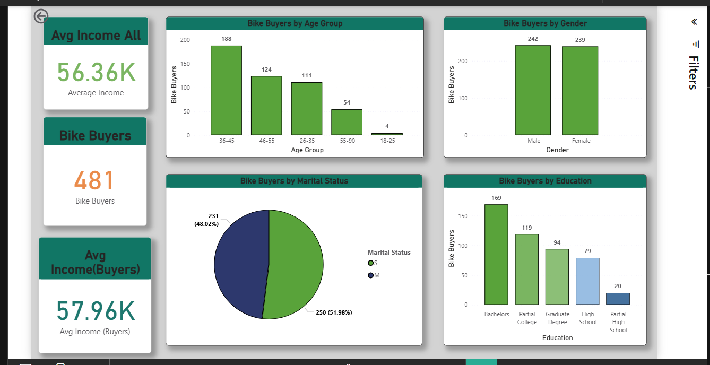
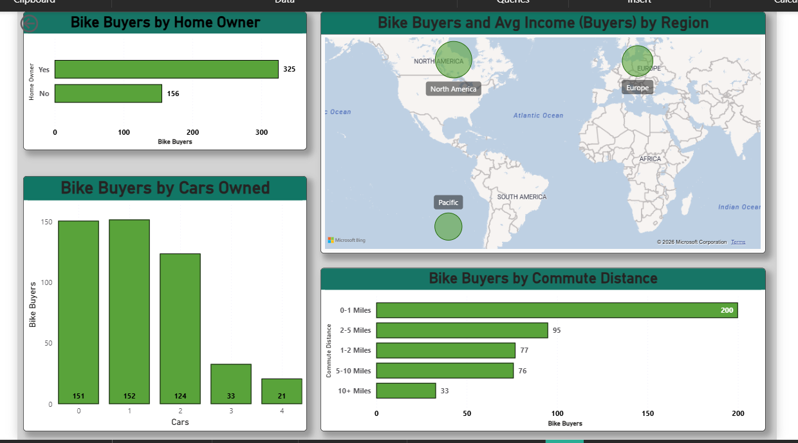

# Bike-Buyers-Analysis-PowerBI
Power BI dashboard analyzing motorbike buyers using demographic and behavioral data

# Bike Buyers Analysis Dashboard (Power BI)

## 📌 Project Overview
This project analyzes motorbike purchasing behavior using customer demographic and behavioral data.  
The goal is to identify patterns that influence motorbike purchases and regional demand.

## 📊 Dashboard Pages
- **Project Overview** – Description and navigation
- **Overview** – KPIs and buyer vs non-buyer summary
- **Demographics** – Age, gender, marital status, education, income analysis
- **Behavioral Insights** – Commute distance, home ownership, car ownership, and regional demand

## 🛠 Tools Used
- Power BI
- Data Visualization
- Data Analysis

## 🔍 Key Insights
- Middle-aged customers (36–45) show the highest motorbike purchases
- Buyers generally have slightly higher average income
- Shorter commute distances are associated with higher purchase rates
- Regional differences highlight demand concentration

## 📁 Files Included
- `.pbix` Power BI report
- Dashboard screenshots
- ## 📷 Dashboard Screenshots

### Project Overview

### Overview

### Demographics

### Behavioral Insights

